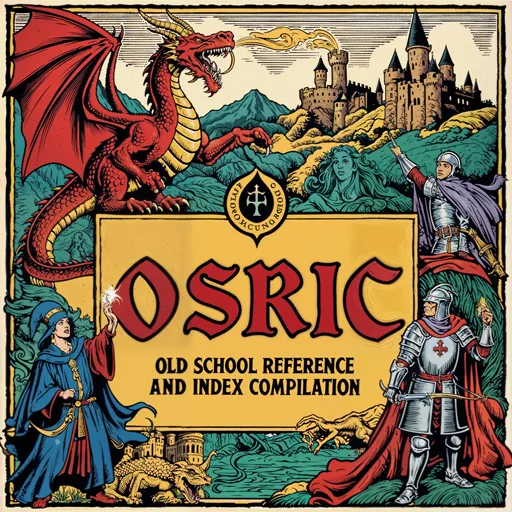

# OSRIC Rules Engine

OSRIC, short for Old School Reference and Index Compilation, is a fantasy role-playing game system and a remake of the 1st edition of Advanced Dungeons & Dragons (AD&D).



---

## Usage Overview

```ts
import { Engine } from '@osric';

const config = {
  seed: 12345,
  logging: { level: 'info' },
  features: { morale: true },
  adapters: { rng: 'default', persistence: null },
};

const engine = new Engine(config);

const heroRes = await engine.command.createCharacter({ name: 'Hero', level: 1, hp: 12 });
const foeRes  = await engine.command.createCharacter({ name: 'Foe', level: 1, hp: 10 });

const atk = await engine.command.attackRoll({ attacker: heroRes.data.characterId, target: foeRes.data.characterId });
await engine.command.dealDamage({ source: heroRes.data.characterId, target: foeRes.data.characterId, attackContext: atk.data });
```

---

## Engine Architecture

```
┌────────────────────────┐
│        Engine          │  Public façade (commands, entities, store, events)
├──────────┬─────────────┤
│ Registry │ Scheduler   │  Command+Rule lookup / execution order
├──────────┼─────────────┤
│ Rule DAG │ Validation  │  Auto-built dependency graph + zod schemas
├──────────┴─────────────┤
│ Store                  │  Jotai-backed world state
└────────────────────────┘
```

